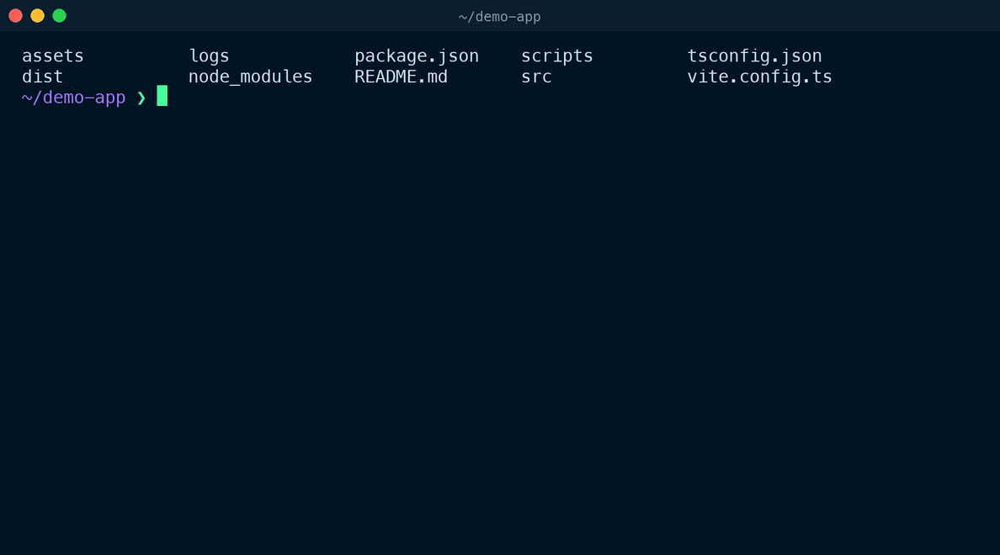
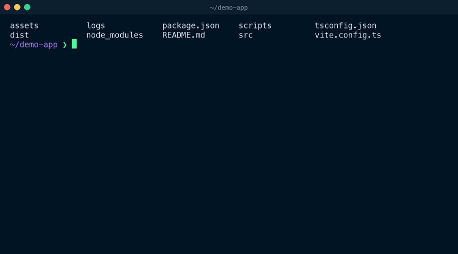

# commander.wezterm

[](https://github.com/sethupavan12/commander.wezterm/actions/workflows/ci.yml)
[](LICENSE)
[](https://wezfurlong.org/wezterm/)
[](#install)

**Describe a shell command in plain English. It lands at your prompt. Nothing runs until you press Enter.**



- A drawer slides up from the bottom of the tab. The pane you were working in isn't touched until you accept a command.
- You get one command, with a short explanation only when it uses something obscure. Not right? Say what to change, or press `Ctrl+R` for a different one.
- Anything destructive comes with a warning and needs a second `Enter`, even if the model forgot to warn you.
- OpenAI by default (`gpt-6-luna` answers in a second or two). Ollama, LM Studio, OpenRouter or any OpenAI-compatible server work too, fully offline if you like.
- No dependencies. One line of Lua, standard-library Python, nothing to pip install.

## Install

**1. Add the plugin to `~/.wezterm.lua`.** Put these two lines just above the `return config` line at the bottom of the file:

```lua
local commander = wezterm.plugin.require("https://github.com/sethupavan12/commander.wezterm")
commander.apply_to_config(config)
```

**2. Give it your OpenAI API key.** Add this line to the file your shell reads at startup, with your own key from [platform.openai.com/api-keys](https://platform.openai.com/api-keys):

```sh
export OPENAI_API_KEY="sk-..."
```

That file is `~/.zshrc` if you use zsh (the default on macOS) or `~/.bashrc` for bash. On fish, add `set -gx OPENAI_API_KEY "sk-..."` to `~/.config/fish/config.fish` instead. No restart needed: the plugin reads the key from there each time it opens.

**3. Press `Cmd+I`** (`Ctrl+Shift+I` on Linux) in any WezTerm pane.

You'll need WezTerm 20230320 or newer and Python 3.8+ on macOS or Linux. On a Mac, that's Homebrew's Python or the one from `xcode-select --install`. Using Ollama or another provider instead of OpenAI? See [Run it offline](#run-it-offline).

## Use it

| Key | |
| --- | --- |
| `Cmd+I` | Open the drawer. Press again to hide it. |
| Type, then `Enter` | Ask, or tell it what to change. |
| `Enter` | Use the command: it's pasted at your prompt. |
| `Ctrl+R` | A different command for the same task. |
| `Esc` | Hide. Your chat is still there next time. |

You don't need to memorise these. The bar at the bottom of the drawer always shows what you can press.

## Run it offline

```lua
commander.apply_to_config(config, {
  base_url = "http://localhost:11434/v1", -- Ollama
  model = "qwen2.5-coder:7b",
})
```

<details>
<summary><b>See the full tour</b>: refining a command, running it, and a dangerous command asking twice (40s)</summary>



</details>

<sub>Both GIFs are captured from a live WezTerm session against the real `gpt-6-luna` API, at real speed.</sub>

## Docs

- [Configuration](docs/configuration.md): every option, API keys, other providers, screen context, your own key binding
- [Safety and privacy](docs/safety.md): what's sent, why nothing runs by itself, how dangerous commands are caught
- [How it works](docs/how-it-works.md): the Lua and Python halves, and why Python
- [Troubleshooting](docs/troubleshooting.md)

## Contributing

Bug reports and pull requests are welcome. See [CONTRIBUTING.md](CONTRIBUTING.md), and report security problems privately as described in [SECURITY.md](SECURITY.md).

[MIT](LICENSE)
