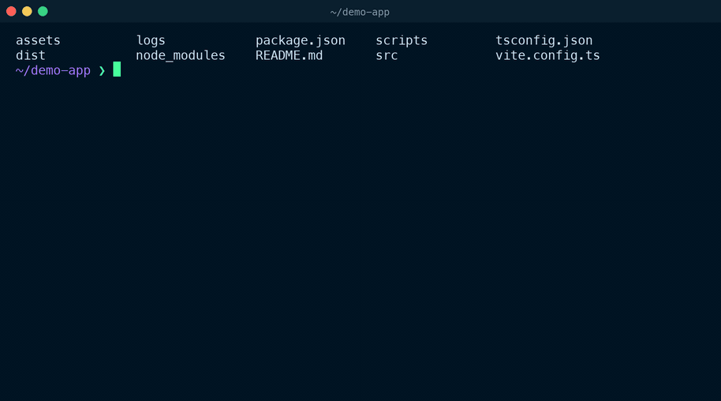

# commander.wezterm

[](https://github.com/sethupavan12/commander.wezterm/actions/workflows/ci.yml)
[](LICENSE)

A [WezTerm](https://wezfurlong.org/wezterm/) plugin. Press a key in WezTerm, say what you want in plain English, get a shell command back. Press Enter and it lands on your prompt, ready to edit or run.



<sub>Captured from a live WezTerm session running the plugin against the real `gpt-6-luna` API, at real speed.</sub>

It opens as a drawer at the bottom of the tab, so the pane you were working in stays where it was. Nothing gets typed into it until you accept a command, and accepting doesn't run it. You still press Enter yourself.

The explanation only shows up when the command has something worth explaining. You won't get a lecture on `git status`. Destructive commands come with a one-line warning.

## Install

You need:

- WezTerm 20230320 or newer (the first release with plugins). Tested on 20240203.
- Python 3.8 or newer, standard library only, nothing to pip install. On macOS that's Homebrew's `python3` or the one that comes with the Xcode Command Line Tools (`xcode-select --install`). Without either, `/usr/bin/python3` is only a stub that asks you to install them. Linux distros ship Python already.
- macOS or Linux. Windows isn't supported yet.
- An OpenAI API key, or any OpenAI-compatible server (Ollama, LM Studio, OpenRouter, Groq, vLLM, and so on).

Add this to `~/.wezterm.lua`, after `config` is created:

```lua
local commander = wezterm.plugin.require("https://github.com/sethupavan12/commander.wezterm")
commander.apply_to_config(config)
```

Then make sure `OPENAI_API_KEY` is exported in your shell profile. That's it. Press `Cmd+I` on macOS or `Ctrl+Shift+I` on Linux.

To update later, run `wezterm.plugin.update_all()` from the debug overlay (`Ctrl+Shift+L`), then reload your config.

## Keys

In your terminal:

| Key | What it does |
| --- | --- |
| `Cmd+I` / `Ctrl+Shift+I` | Open the drawer. Press again inside it to hide it. |

In the drawer you don't need to remember any of this. A bar along the bottom always shows the keys that work right now, with what each one does.

| Key | What it does |
| --- | --- |
| Type, then `Enter` | Ask. Once there's a suggestion, whatever you type is feedback on it ("only .js files", "use rg instead"). |
| `Enter` with nothing typed | Use the suggested command: it's pasted into your pane and you jump back there. If the command comes with a warning, press `Enter` a second time to confirm. |
| `Ctrl+R` | Different command: get another command for the same task. |
| `Ctrl+L` | Start a new chat. |
| `Esc` or `Ctrl+D` | Hide the drawer. While waiting for an answer, `Esc` cancels instead. |
| `Ctrl+C` | Clear what you've typed. With nothing typed, hide the drawer. |
| `Up` / `Down` | Bring back questions you asked before. |
| `Ctrl+A`, `Ctrl+E`, `Ctrl+B`, `Ctrl+F`, `Ctrl+W`, `Ctrl+U`, `Ctrl+K`, `Alt+B`, `Alt+F` | The usual line editing, for people who like it. |

Each pane has its own chat. Hide the drawer, do something else, press the key again, and the conversation is still there. Chats untouched for a day start fresh.

## The API key

The drawer looks for a key in this order:

1. `api_key` in your plugin options. Works, but it puts the key in your config file.
2. The environment variable named by `api_key_env` (default `OPENAI_API_KEY`).
3. If that's empty: the output of `api_key_command` when you set one, otherwise your login shell. On macOS, WezTerm started from the Dock doesn't see variables exported in `~/.zshrc`, so the drawer starts your shell once in the background (`$SHELL -l -i -c env`) and reads them from there. `OPENAI_BASE_URL` is picked up the same way. This takes under a second and happens while you're still typing.

Your OpenAI key only goes to OpenAI, or to `$OPENAI_BASE_URL` if you set that, which is the convention the official SDKs follow. If you point `base_url` at another provider, name that provider's key with `api_key_env` or `api_key_command`. The drawer won't quietly send your OpenAI key there. It also refuses to send any key over plain `http://` except to localhost, and it doesn't follow redirects.

If you keep the key in a password manager, use `api_key_command`:

```lua
commander.apply_to_config(config, {
  -- 1Password
  api_key_command = "op read op://Private/OpenAI/credential",
  -- or the macOS keychain: security add-generic-password -s openai -a "$USER" -w
  -- api_key_command = "security find-generic-password -s openai -w",
})
```

## Configuration

Every option is optional. These are the defaults:

```lua
commander.apply_to_config(config, {
  key = "i",                     -- set to false to bind it yourself (see below)
  mods = "CMD",                  -- "CTRL|SHIFT" on Linux

  model = "gpt-6-luna",
  base_url = nil,                -- nil uses $OPENAI_BASE_URL, then https://api.openai.com/v1
  api_key_env = nil,             -- nil means OPENAI_API_KEY (see "The API key")
  api_key_command = nil,
  api_key = nil,
  reasoning_effort = nil,        -- nil: "none" for gpt-6-luna (fastest), not sent for other models
  timeout = 60,                  -- seconds; raise it for slow local models

  height = 0.4,                  -- drawer height as a fraction of the tab
  screen_context_lines = 0,      -- send this many lines of your pane's output along
  python = nil,                  -- path to python3; nil finds one
  helper = nil,                  -- path to commander.py; nil finds it in the installed plugin
})
```

### Other providers

Anything that speaks the OpenAI chat completions API works. Point `base_url` at it and pick a model:

```lua
-- Ollama
commander.apply_to_config(config, { base_url = "http://localhost:11434/v1", model = "qwen2.5-coder:7b" })

-- LM Studio
commander.apply_to_config(config, { base_url = "http://localhost:1234/v1", model = "your-loaded-model" })

-- OpenRouter
commander.apply_to_config(config, {
  base_url = "https://openrouter.ai/api/v1",
  model = "openai/gpt-6-luna",     -- any model id OpenRouter lists
  api_key_env = "OPENROUTER_API_KEY",
})
```

Local servers don't need a key. If none is found, the request goes out without one.

Small local models are slow and wrong more often. A 4B model can take close to a minute per answer on a laptop, so bump `timeout` if you go that way.

### Screen context

With `screen_context_lines = 80`, the last 80 lines of the pane you came from go along with your question. Then "fix that error" or "rerun that with sudo" just work. It's off by default because whatever is on your screen, tokens and passwords included, gets sent to the model.

### Your own key binding

```lua
commander.apply_to_config(config, { key = false })

table.insert(config.keys, { key = "k", mods = "CTRL|ALT", action = commander.action() })
```

You can also call `commander.toggle(window, pane)` from your own `action_callback`.

## What gets sent

Each request carries your question, the conversation so far in that pane, and a short description of the environment: OS and version, shell name, current directory, and up to 60 file names from that directory. Nothing from your screen is sent unless you turn on `screen_context_lines`.

If the pane is running `ssh` (or `mosh`, `docker`, `kubectl` and friends), the drawer says so instead. It tells the model the command runs on another machine with an unknown OS and leaves your local file names out.

File names and screen contents can come from anywhere, including a repository you just cloned or a server you're logged into. Someone could name a file to trick the model. The model is told to treat them as data, and on top of that the drawer checks every suggestion locally: anything that deletes recursively, uses `sudo`, pipes a download into a shell, force-pushes, wipes disks and so on gets a warning even if the model gave none, and needs a second `Enter`.

The drawer only opens in panes on this machine. In panes from an SSH or TLS mux domain (`ssh_domains`, `tls_clients`), where the shell runs on another host, you get a message instead.

Chats are saved as JSON under `~/.local/state/wezterm-commander/` (or `$XDG_STATE_HOME`), in a folder only you can read. The last 200 questions you typed are kept there too, so `Up` can recall them in any pane. Delete the folder to wipe it all. API keys are never written to disk.

## How it works

The plugin is two files.

`plugin/init.lua` binds the key and opens a full-width split at the bottom of the tab running `plugin/commander.py`. It passes the settings, the target pane's id and its working directory through an environment variable.

`commander.py` is the drawer. It draws the chat, edits your input, and calls the chat completions endpoint with Python's standard library. When you accept a command, it sets an OSC 1337 user var with the command in it and exits. The Lua side catches the `user-var-changed` event, pastes the command into your original pane with `pane:send_paste` and focuses it.

Only single lines are ever pasted. A newline in a paste is a problem: shells without bracketed paste (like the bash 3.2 that ships as macOS's `/bin/bash`, or a `python` prompt) run each line the moment it arrives. So the model is asked for one line, and when it sends several anyway the drawer joins them (`for f in *; do echo $f; done`) so what you see is what gets pasted. If joining would change the meaning, as with a heredoc, `Enter` copies the command to your clipboard instead, and the Lua side refuses to paste anything with a newline in it as a second line of defence.

Model replies are untrusted text. Before anything is drawn or pasted, control characters, bidi overrides and invisible characters are stripped, so a reply can't sneak escape sequences into your terminal or show you something different from what gets pasted. The Lua side only accepts events from drawer panes it opened itself, so another program printing the same escape sequence can't make it paste anything.

### Why Python?

Most WezTerm plugins are pure Lua, and this one could have been too: prompt with `PromptInputLine`, call `curl`, show the answer in an `InputSelector`. But those overlays are one-shot dialogs. A chat you can refine, a scrolling history, a line editor and a key bar need a real program in a real pane. Python's standard library has everything that takes (HTTP, JSON, a raw terminal) and is already on nearly every Mac and Linux box, so the plugin stays a one-line install with nothing to download or compile.

## Troubleshooting

**Nothing happens when I press the key.** Check WezTerm's debug overlay (`Ctrl+Shift+L`) for Lua errors, and that `apply_to_config` runs before you `return config`. If you set `config.keys = {...}` after calling `apply_to_config`, you've overwritten the binding. Call it after.

**"No API key found".** Check that your login shell actually sees the key: `$SHELL -lic 'echo $OPENAI_API_KEY'`. If it prints nothing, export it in `~/.zshrc` (or your shell's equivalent) or use `api_key_command`. See [The API key](#the-api-key).

**The drawer flashes and disappears.** Python failed to start. On a fresh Mac this is usually the `/usr/bin/python3` stub: run `xcode-select --install`, or `brew install python`. Run `python3 /path/to/commander.py` in a pane to see the error, or set `python` to an interpreter you know works. Plugins live under `~/Library/Application Support/wezterm/plugins/` on macOS and `~/.local/share/wezterm/plugins/` on Linux.

**SSL errors with python.org Python on macOS.** Run its `Install Certificates.command` once, or point `python` at `/usr/bin/python3` or Homebrew's.

**The drawer stays open after I accept, saying the process exited.** You have `exit_behavior = "Hold"`. The drawer closes by exiting, so use `"Close"` or `"CloseOnCleanExit"`.

## Development

```sh
python3 -m unittest discover -s tests      # Python tests, standard library only
luajit tests/test_init.lua                 # Lua tests against a fake wezterm module
uvx ruff check plugin tests && uvx ruff format --check plugin tests
npx @johnnymorganz/stylua-bin --check plugin tests
```

To try local changes, load the plugin from your checkout instead of GitHub:

```lua
local commander = dofile("/path/to/commander.wezterm/plugin/init.lua")
commander.apply_to_config(config, { helper = "/path/to/commander.wezterm/plugin/commander.py" })
```

## Contributing

Bug reports and pull requests are welcome. [CONTRIBUTING.md](CONTRIBUTING.md) covers setup, the checks CI runs, and the few rules that keep the plugin a one-line install. Please report security problems privately, as described in [SECURITY.md](SECURITY.md).

## License

[MIT](LICENSE)
